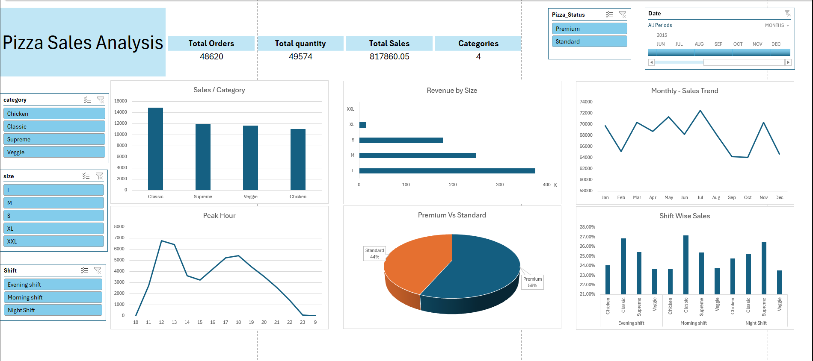

.
# Pizza Sales Analysis Dashboard (2015)

## Overview
This project demonstrates a **dynamic and interactive Excel dashboard** created to analyze pizza sales data for the year 2015. The dashboard provides a comprehensive view of sales performance, highlighting key metrics and trends for better decision-making.

## Features
- **Dynamic Filtering**: Use slicers for category, size, shift, and pizza status to drill down into specific data points.
- **Visual Insights**:
  - **Sales by Category**: Compare sales across pizza categories like Chicken, Classic, Supreme, and Veggie.
  - **Revenue by Size**: Analyze revenue generated by different pizza sizes.
  - **Peak Hour Analysis**: Identify peak sales hours.
  - **Monthly Sales Trend**: Observe sales trends across months.
  - **Shift-Wise Sales Performance**: Compare sales distribution across shifts (Morning, Evening, Night).
  - **Premium vs Standard Sales**: Understand customer preferences for premium vs standard pizzas.

## Key Insights
- **Top Performing Category**: Classic pizzas generated the highest sales.
- **Revenue Leader**: Large (L) size pizzas contributed the most to overall revenue.
- **Peak Sales Hour**: The busiest hour for sales was 6 PM (18:00).
- **Customer Preferences**: 56% of customers preferred premium pizzas over standard options.

## Tools and Techniques
- **Microsoft Excel**: Used for data cleaning, preprocessing, and visualization.
- **Data Cleaning**: Removed inconsistencies and ensured uniform formatting.
- **Preprocessing**: Created calculated columns for categories like shifts and dates.
- **Pivot Tables and Charts**: Used for summarizing data and creating visualizations.
- **Slicers**: Added to allow interactive filtering.

## Dashboard Preview
Here’s a snapshot of the dashboard:



## How to Use
1. Clone this repository:
   ```bash
   git clone [https://github.com/usamaabbasi135/Pizza-Sales-Analysis]
2. Open the Excel file.
3. Use the slicers to interact with the data and gain insights.
## Contact
Project Video: [https://www.youtube.com/watch?v=yZIMWAeeUeE]
Feel free to reach out if you have questions or want to collaborate:
**Email**: usamahafeez.abbasi1234@gmail.com
**Phone**: +92 334 5259239
